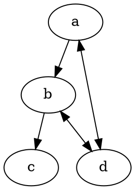
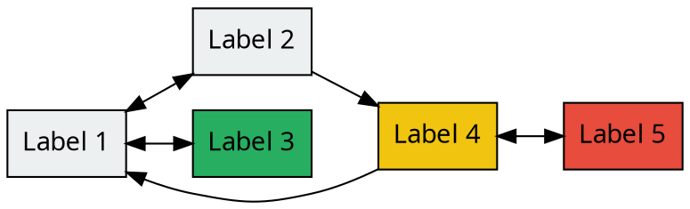
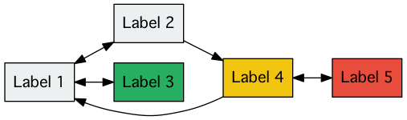

# Tinydot

Tiny language alternative to DOT.

## Installation

```sh
$ gem install tinydot
```

[Graphviz](http://www.graphviz.org/) is required to convert files written by tinydot into images.

## Usage

```sh
$ tinydot convert sample.tinydot
```

`tinydot` command converts `*.tinydot` or `*.tdot` into `*.dot` and converts the converted files into graph images using Graphviz.

## Examples

### Nodes, Edges

```rb
digraph "sample" do
  a >> b >> c
  a <=> d
  b <=> d
end
```

is equivalent to



and converted into a following graph.


### Attributes

```rb
digraph "sample2", rankdir: "LR" do
  node shape: "record", style: "filled", fontname: "Osaka", fillcolor: "#ECF0F1"

  a "Label 1"
  b "Label 2"
  c "Label 3", fillcolor: "#27AE60"
  d "Label 4", fillcolor: "#F1C40F"
  e "Label 5", fillcolor: "#E74C3C"

  a <=> b
  a <=> c
  b >> d
  d <=> e
  d >> a
end
```

is equivalent to



and converted into a following graph.



