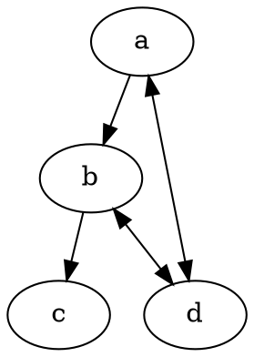
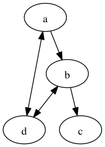

# Tinydot

Tiny language alternative to DOT.

## Installation

```sh
$ gem install tinydot
```

[Graphviz](http://www.graphviz.org/) is required to convert files written by tinydot into images.

## Usage

```sh
$ tinydot convert sample.tinydot
```

`tinydot` command converts `*.tinydot` or `*.tdot` into `*.dot` and converts the converted files into graph images using Graphviz.

## Examples

```rb
digraph "sample" do
  a >> b >> c
  a <=> d
  b <=> d
end
```

is equivalent to



and converted into a following graph.



